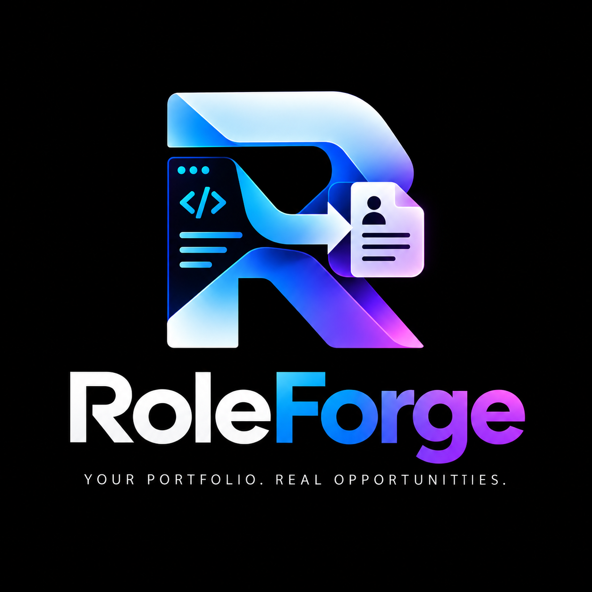

# RoleForge



**RoleForge** is an agentic career compiler that transforms your portfolio codebase into job-specific applications. It treats your code as the source of truth, extracts verifiable evidence, matches it to job requirements, and generates tailored resumes, CVs, and opportunity discoveries.

## What RoleForge Is

RoleForge is NOT a generic AI resume writer. It behaves like a compiler:

```
Portfolio / Codebase
        ↓
Repository Analysis
        ↓
Candidate Evidence
        ↓
Career Knowledge Base
        ↓
Job Description
        ↓
Requirement Extraction
        ↓
Evidence ↔ Requirement Matching
        ↓
Application Strategy
        ↓
LaTeX Generation
        ↓
Resume / CV
        ↓
Truth + Quality Validation
        ↓
PDF
```

## Core Principles

### Evidence Over Inference
Every claim must be backed by verifiable evidence from your portfolio. RoleForge never invents experience, skills, or achievements.

### Truth Over Keyword Stuffing
RoleForge does not fabricate skills to match job keywords. Related skills may be labeled as transferable, but never represented as direct experience.

### Source Provenance
Every claim includes traceable evidence sources. You can always verify where a claim originated.

### Reusable Resume Families
RoleForge groups similar roles into reusable resume families, reducing redundant generation while maintaining job-specific relevance.

### Human Approval
Applications are prepared for review, not blindly submitted. You always have final approval.

## Features

### Portfolio Analysis
- Analyzes repository structure, languages, frameworks, and tools
- Extracts evidence from README files, package manifests, and documentation
- Parses git history when useful (commits, PRs, issues)
- Builds a normalized candidate knowledge base

### Evidence Extraction
- Skills with confidence levels (DIRECT, SUPPORTED, INFERRED, WEAKLY_INFERRED, UNSUPPORTED)
- Projects with technologies, responsibilities, and outcomes
- Achievements with traceable sources
- Education and experience (when verifiable)

### Job Description Acquisition
Priority order:
1. Official job API (if available)
2. Official company careers page
3. Job URL provided by user
4. Permitted/legal web retrieval
5. User-provided job description
6. Online search for verification

### Requirement Matching
- Maps candidate evidence to job requirements
- Assigns match levels (strong, partial, transferable, weak, none)
- Generates fit and gap analysis
- Provides overall fit score

### Resume Generation
- Multiple templates (ATS-optimized, engineering, modern, academic, research)
- Job-specific content selection
- Project ranking by relevance
- Skill emphasis based on requirements
- LaTeX source and PDF output

### CV Generation
- Separate from resume (broader, research-focused)
- Only generated when sufficient evidence exists
- Includes publications, research, academic work

### Truth Audit
- Validates every claim against evidence
- Removes unsupported claims
- Flags claims requiring review
- Generates audit report with approval rate

### PDF Validation
- Compilation checks
- Page count validation
- Overflow detection
- Link verification
- Glyph checking
- Duplicate detection

### Related Job Discovery
- Discovers roles based on skills and domain
- Clusters jobs by role family
- Identifies reusable resume families
- Provides effort estimates for each opportunity
- Company-level role discovery

### Career Mapping
- Identifies evidence-supported career directions
- Maps adjacent domains
- Highlights transfer opportunities

## Installation

RoleForge is designed as an agent skill. Install it in your agent environment:

```bash
# For Cursor
npx skills add shaxntanu/roleforge --agent cursor --global

# For Claude Code
npx skills add shaxntanu/roleforge --agent claude-code --global

# For Codex
npx skills add shaxntanu/roleforge --agent codex --global
```

## Usage

### Basic Resume Generation

```
Use RoleForge to generate a resume for this repository:
/path/to/portfolio

For this job:
https://company.com/careers/role-123
```

### With CV and Discovery

```
Generate a resume and CV from my portfolio at /path/to/portfolio
for the embedded systems role at this URL: https://company.com/jobs/456
Also discover related jobs and generate a career map.
```

### Job Analysis Only

```
Analyze how my portfolio at /path/to/portfolio matches this job description:
[pasted job description]
```

### Related Job Discovery

```
Find related embedded systems roles that can reuse my existing resume family
based on my portfolio at /path/to/portfolio
```

## Architecture

RoleForge is built around these major components:

```
                    ┌───────────────────────┐
                    │   CANDIDATE REPO      │
                    │   SOURCE OF TRUTH     │
                    └───────────┬───────────┘
                                ↓
                    ┌───────────────────────┐
                    │ Repository Analyzer    │
                    └───────────┬───────────┘
                                ↓
                    ┌───────────────────────┐
                    │ Evidence Extraction    │
                    └───────────┬───────────┘
                                ↓
                    ┌───────────────────────┐
                    │ Career Knowledge Base │
                    └───────────┬───────────┘
                                ↑
                    ┌───────────┴───────────┐
                    │ Optional User Facts   │
                    │ Existing CV / Resume  │
                    └───────────────────────┘
```

Then:

```
Candidate Evidence
        +
Normalized Job Requirements
        ↓
Requirement Matcher
        ↓
Evidence Map
        ↓
Fit / Gap Analysis
        ↓
Role & Resume Strategy
        ↓
Content Selection
        ↓
LaTeX Composer
        ↓
Resume / CV
        ↓
Validation
```

## Repository Structure

```
RoleForge/
├── SKILL.md
├── README.md
├── LICENSE
│
├── skill/
│   ├── workflow/
│   │   └── pipeline.ts
│   ├── analyzers/
│   │   ├── repository-analyzer.ts
│   │   ├── evidence-extractor.ts
│   │   ├── candidate-builder.ts
│   │   └── job-normalizer.ts
│   ├── matchers/
│   │   └── requirement-matcher.ts
│   ├── generators/
│   │   └── latex-generator.ts
│   ├── validators/
│   │   ├── pdf-validator.ts
│   │   └── truth-auditor.ts
│   └── discovery/
│       └── job-discovery.ts
│
├── schemas/
│   ├── candidate.schema.json
│   ├── evidence.schema.json
│   ├── job.schema.json
│   ├── match.schema.json
│   ├── strategy.schema.json
│   ├── truth-audit.schema.json
│   └── opportunity.schema.json
│
├── examples/
│   ├── candidate.example.json
│   ├── job.example.json
│   ├── evidence-map.example.json
│   └── truth-audit.example.json
│
├── bin/
│   └── roleforge.mjs
│
├── tests/
│   └── validation.test.mjs
│
├── docs/
│   ├── architecture.md
│   └── workflow.md
│
├── templates/
│   ├── resumes/
│   │   ├── ats-resume.tex
│   │   ├── engineering-resume.tex
│   │   └── modern-resume.tex
│   └── cvs/
│       ├── academic-cv.tex
│       └── research-cv.tex
│
└── web/
    └── ...
```

## Documentation

View the complete architecture documentation:
- **GitHub**: [https://github.com/shaxntanu/roleforge](https://github.com/shaxntanu/roleforge)
- **Architecture**: See [docs/architecture.md](docs/architecture.md)
- **Workflow**: See [docs/workflow.md](docs/workflow.md)

## CLI Tooling

RoleForge includes a validation CLI for schema validation:

```bash
# Validate a candidate profile
node bin/roleforge.mjs validate candidate candidate.json

# Validate a job description
node bin/roleforge.mjs validate job job.json

# Validate a truth audit
node bin/roleforge.mjs validate truth-audit audit.json

# Run all validation tests
node tests/validation.test.mjs
```

## Development

### Running Tests

```bash
node tests/validation.test.mjs
```

### Schema Validation

All JSON artifacts should validate against their respective schemas before being used in the pipeline.

### Adding New Components

1. Create the TypeScript implementation in the appropriate `skill/` subdirectory
2. Define the JSON schema in `schemas/`
3. Create an example in `examples/`
4. Add validation to the test suite

## Limitations

- **No Hallucination**: RoleForge never invents experience, skills, achievements, or metrics
- **Evidence-Only**: Claims must have verifiable evidence from the portfolio
- **Web Retrieval Constraints**: Respects robots.txt, authentication, and access controls
- **LaTeX Compilation**: Requires pdflatex to be installed for PDF generation
- **Job Source Priority**: Official sources are preferred; user-provided descriptions may be unverified

## Privacy Model

- No uploads to third-party services without explicit authorization
- No logging of private source code, secrets, or personal identifiers
- Candidate repository remains canonical source for claims
- Web retrieval only for job information and opportunity discovery

## License

MIT License - see [LICENSE](LICENSE) for details.

## Acknowledgments

RoleForge's documentation website design is inspired by [Archify](https://tt-a1i.github.io/archify/):
- Website: https://tt-a1i.github.io/archify/
- GitHub: https://github.com/tt-a1i/archify

RoleForge learns from Archify's information architecture and visualization approach while creating an original visual language and implementation for career compilation.
